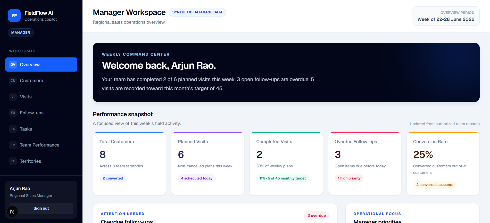
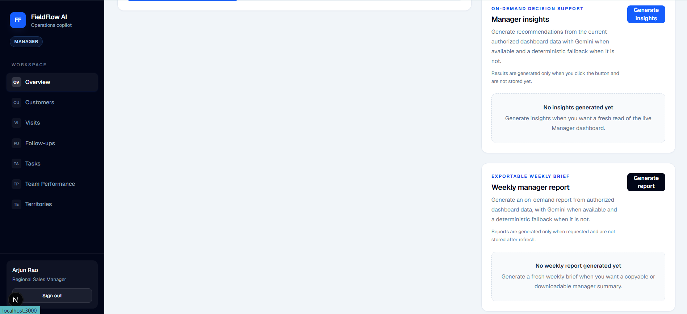
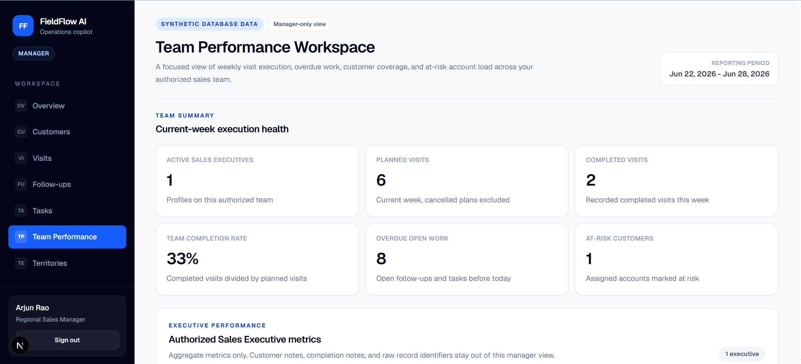
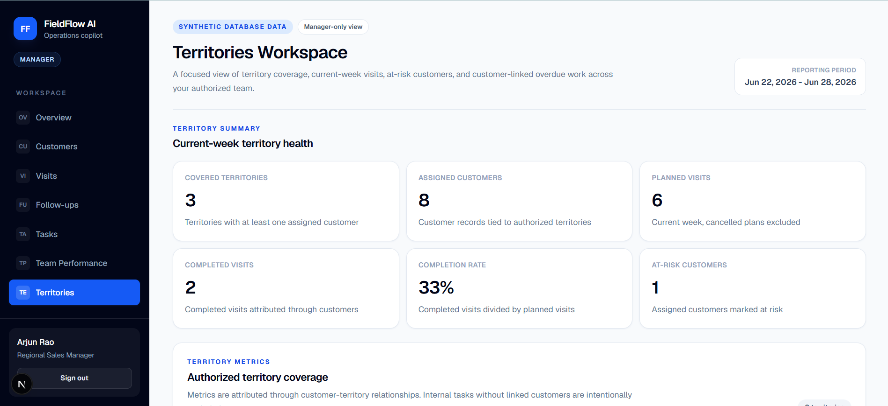
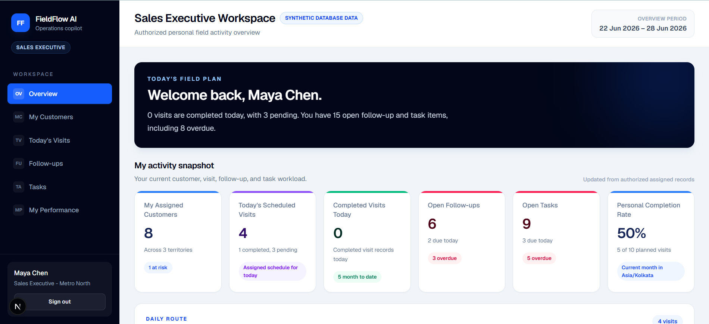
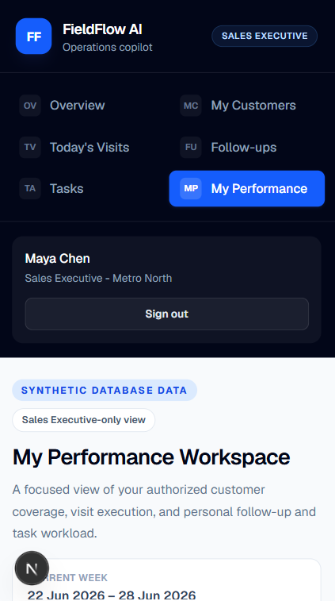

# FieldFlow AI

FieldFlow AI is a portfolio-style, role-based field-sales and dealership-operations copilot built with synthetic demo data. It gives managers a live view of team execution while helping Sales Executives track their assigned customers, visits, follow-ups, tasks, and personal performance.

The project is designed as a free-tier friendly demo: small synthetic datasets, on-demand AI/report generation, no background AI jobs, and no real customer or employee data.

## Roles and workspaces

### Manager

Managers can use:

- **Dashboard** - live team KPIs, charts, overdue work, priorities, Manager Insights, and Weekly Manager Report.
- **Customers** - authorized team customer directory and customer detail views.
- **Visits** - team visit planning and completed visit outcomes.
- **Follow-ups** - team follow-up tracking and Manager-created assignments.
- **Tasks** - team task tracking and Manager-created assignments.
- **Team Performance** - dedicated team execution workspace.
- **Territories** - dedicated territory performance workspace.
- **Manager Insights** - on-demand insight cards from Gemini when configured, otherwise a deterministic rules-based fallback.
- **Weekly Manager Report** - on-demand weekly report with copy/download Markdown support and deterministic fallback.

### Sales Executive

Sales Executives can use:

- **Overview** - live personal dashboard for assigned customers, visits, follow-ups, and tasks.
- **My Customers** - assigned customer directory and details.
- **Today's Visits** - assigned visit schedule and secure visit completion.
- **Follow-ups** - assigned follow-ups and secure follow-up completion.
- **Tasks** - assigned tasks and secure task completion.
- **My Performance** - dedicated personal KPI and workload workspace.

## Screenshots

### Manager workspace



Manager dashboard with authorized team KPIs, overdue work, priorities, and chart-based performance context.



On-demand Manager Insights and Weekly Manager Report output, with deterministic fallback support when Gemini is unavailable.



Dedicated Team Performance workspace for comparing Sales Executive workload, completion, and overdue work.



Territories workspace showing customer coverage, visit progress, and territory-level operational risk.

### Sales Executive workspace



Sales Executive overview focused on assigned customers, today's work, urgent follow-ups, and task priorities.



Mobile My Performance workspace with personal KPIs, workload trends, and assigned customer coverage.

## Main workflow

1. Managers create and assign visit plans, follow-ups, and tasks.
2. Sales Executives complete their own assigned work.
3. Supabase Row Level Security and server-side checks keep each role scoped to authorized data.
4. Dashboards and workspaces refresh from live synthetic database records.
5. Manager Insights and Weekly Manager Report are generated on demand; they are not persisted by the current application code.

## Technology stack

- **Application:** Next.js App Router 16, React 19, TypeScript
- **Styling:** Tailwind CSS
- **Database/auth:** Supabase Auth and PostgreSQL
- **Authorization:** Supabase Row Level Security plus server-side current-user checks
- **Typed data access:** generated Supabase database types with typed browser/server clients
- **Charts:** Recharts
- **AI/report generation:** Gemini through server-side routes, with deterministic fallback logic
- **Testing:** Vitest
- **CI:** GitHub Actions

## Local setup

Use Node.js 24 to match the GitHub Actions workflow.

Install dependencies:

```bash
npm install
```

Create a local environment file from the placeholder names in `.env.example`. Do not commit real values.

```text
NEXT_PUBLIC_SUPABASE_URL=
NEXT_PUBLIC_SUPABASE_PUBLISHABLE_KEY=
GEMINI_API_KEY=
GEMINI_MODEL=
```

`GEMINI_API_KEY` is optional for local fallback behavior. Without it, Manager Insights and Weekly Manager Report use deterministic rules-based output.

Database prerequisite:

- Create a Supabase project.
- Create the expected synthetic demo Auth users before applying the bootstrap migration:
  - `manager@fieldflow.test`
  - `maya.chen@fieldflow.test`
- Apply the migrations in `supabase/migrations` in filename order using your normal Supabase workflow.
- Keep all data synthetic.

Run the development server:

```bash
npm run dev
```

Run quality checks:

```bash
npm run test
npm run lint
npm run build
```

## Architecture and security

- App Router routes live under `src/app`.
- Feature code lives under `src/features`.
- Supabase and auth utilities live under `src/lib`.
- Server Components and server-only data loaders are preferred for database reads.
- Client Components are used only where browser interaction is needed, such as forms, completion actions, charts, and on-demand report/insight buttons.
- Supabase Auth resolves the signed-in user; application role and team come from `public.profiles`.
- Managers are scoped to their team.
- Sales Executives are scoped to their assigned records.
- Workflow writes use secure Supabase RPCs instead of direct browser table writes.
- Application code uses publishable Supabase keys only; no service-role credential is used in the app.
- Gemini calls are server-side only and are explicitly triggered by the Manager.
- Rules-based fallback logic keeps insights and reports usable without an AI key.

## Testing and CI

The test suite focuses on deterministic business logic and API boundaries:

- Manager dashboard rules and chart-supporting calculations
- Manager Insights rules
- Weekly Manager Report fallback and Markdown output
- Manager Insights and Weekly Manager Report API boundary behavior
- Team Performance rules
- Territories rules
- My Performance rules

GitHub Actions runs on pull requests, pushes to `main`, and manual dispatch. The CI command sequence is:

```bash
npm ci
npm run test
npm run lint
npm run build
```

The workflow uses safe CI-only Supabase placeholder values for build-time configuration. It does not deploy.

## Current status

Implemented:

- Role-based authentication flow and protected workspaces
- Supabase schema, RLS policies, typed clients, and synthetic seed data
- Manager and Sales Executive dashboards with live authorized data
- Customers, Visits, Follow-ups, and Tasks workspaces
- Secure RPC-based workflow writes for planning and completion
- Team Performance, Territories, and My Performance dedicated pages
- Manager Insights and Weekly Manager Report with Gemini support and deterministic fallback
- Vitest test baseline and GitHub Actions quality gate

Final portfolio steps still pending:

- Responsive/mobile QA pass
- Accessibility QA pass
- Vercel deployment
- Live deployed smoke testing
- Optional future E2E and RLS integration coverage

No production deployment is documented in this repository yet.

See [`docs/project-plan.md`](docs/project-plan.md) for the detailed internal plan.
